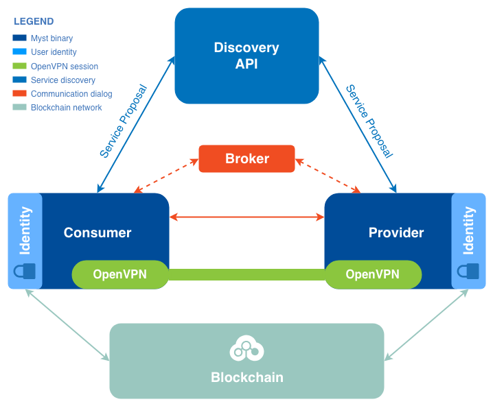

# Node (high level)

Mysterium network will act as a decentralized marketplace between providers and consumers participating in building and maintaining this infrastructure.

## Service provider

Any Mysterium network node can become a Service provider and provide VPN services using his own infrastructure. To become a service provider, the following requirements should be done:
* Create personal user identity;
* Register user identity;
* Create a service proposal;
* Register service proposal in the Discovery service.

All Mysterium network nodes should have a valid identity to interact with other systems. `myst` binary provides a way to create a required identity.

Once identity created, the user should finish the identity registration process to be able to provide services in the Mysterium network.

Registered identity is used as one of the components for creating a service proposal, that acts as a complete description of the service that Service provider going to provide.

The created proposal should be registered in the service discovery component to allow other network participants to search through all available services and consume it.

At that moment the service provider starts to wait for an incoming request. It handles all valid requests and establishes a new VPN session for the user.

The service provider sends to the consumer all required information for establishing VPN session.

## Service consumer

The same `myst` binary could be used as a service consumer. The service consumer should have a similar registered identity as a service provider to be able to communicate with it.

Once consumer identity created and registered in the network, a user can request discovery service for the list of available service proposals. The results of this request can be filtered through the discovery API.

Service consumer chooses the service proposal that fit his requirements and starts communication dialog to negotiate session creation.

Service consumer gets from the provider information required for establishing VPN session. It initializes the VPN session creation process.

When the VPN session established, the service consumer can consume provided services as he needs. And service consumer can close the session any time he wants.

## User identity

There are interconnected software agents (we call one instance of this an identity agent) representing digital identities. Each identity agent acts on behalf of a person controlling the identity.

This software agent is a functional part of the application (a Mysterium network node) used to connect to the Mysterium network to provide or consume VPN services.

The identity is created by generating public and private keys. The identity is identified by a unique identifier derived from a public key by using the last 20 bytes of a keccak256 hash of the public key.

This identity can be made publicly known to other network users by announcing its existence through invoking an identity registration smart contract on the Ethereum blockchain.

After the identity contract is successfully executed the public key of identity is appended to the Ethereum blockchain by miners. At this point, the appended identity becomes a Registered Identity.

Nodes can use the Registered Identities database to lookup public keys associated with other identities. This database is used by nodes to check if the communications received from other nodes comes from validly registered identities and are properly signed.

## Service discovery

Service providers willing to provide VPN services can announce their services to the network.

Every client is free to choose different services from the same or multiple providers on the
Mysterium network. A consumer of VPN services uses Discovery API to search for a service adhering to their requirements:
* service type;
* locations of where service is provided, where your traffic will appear from;
* metering units;
* maximum price per metered unit and committed bandwidth.

To announce the service, the provider's node prepares a service proposal.

### Service proposal

A proposal encodes the proposal format version, provider description, qualitative service definition, and a list of methods to reaching the provider's node.

The provider's identity agent then signs this proposal and the node invokes a service announcement to the Discovery API. The proposal becomes publicly available for everyone.

## Communication channel

Messaging channels enable nodes to exchange messages.

A dialogue between nodes can be started over any type of messaging channel available to both nodes participating in a dialogue. One default channel type and associated communication protocol are be defined and supported on all Mysterium network clients.

Each message sent over a channel is signed by the sender and then encrypted.

Dialogues provide a structured way for two identities (peers) to exchange information needed to arrange payments for services provided and provision service sessions.

### Session establishing

To start a service session a client must request the creation of a session. The request includes a service proposal used to discover a service, a correlation ID used to correlate response, and an application specific data.

After receiving this request, the provider may respond with an acceptance or refusal. In the case that a session opening was refused, a reason of refusal is also supplied. In the case that the opening of a channel is accepted, a session id is supplied and accompanied by application specific data supplied by the provider.

A client should then use application-specific information received from a provider to try to establish a data carrying channel(s) and report back to the node. The client node then sends a message indicating confirmation of the successful opening of a session or failure to open a session to the provider.

### Message broker

At that moment Mysterium network uses centralized message broker for communicating between nodes in the network. It allows to send and receive messages from the registered network participants.

## OpenVPN service

In the current implementation VPN session between a service provider and service consumer established using OpenVPN solution.

It creates a tunnel between provider and service, that is used for real data transfer.

User IP-address is hidden for his requests through the OpenVPN tunnel. Destination services will only see IP-address of the service provider.

All data transferred in this tunnel encrypted to prevent reading it by the unauthorized intermediate systems.

## Blockchain

Mysterium network highly depends on the blockchain technologies.

In the Mysterium network, all network users have an account(identity) managed by the smart contract on Ethereum blockchain.

Ethereum allows running decentralized code with smart contracts, enabling reliable services and payment handling.

Identity service and database of registered identities ensures the proper identity
acknowledgment between service provider and consumer.

All processes in the Mysterium network, like payments and identity registration, done through the Ethereum blockchain smart contracts.

Any participant in the Mysterium network have access to the information stored in the blockchain.
