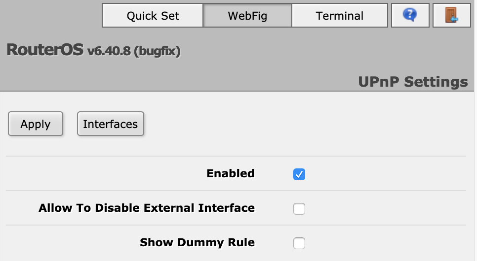
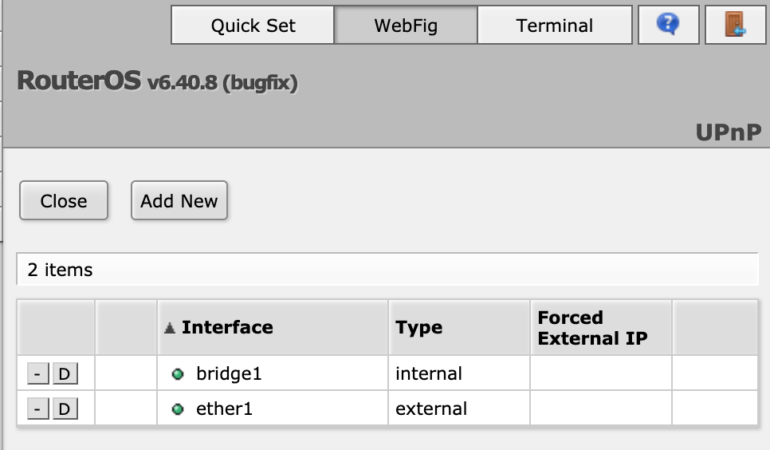
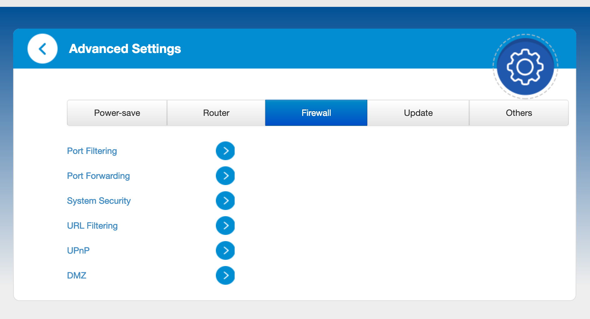
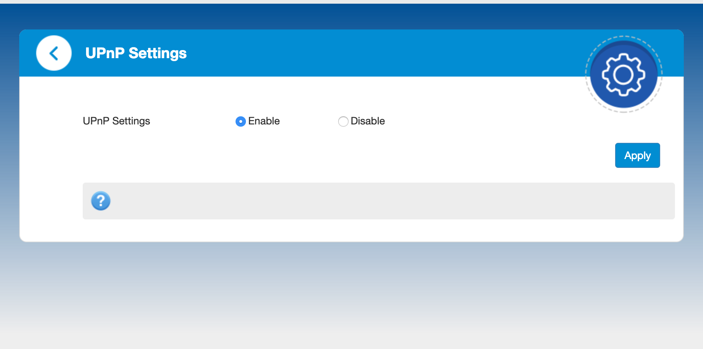
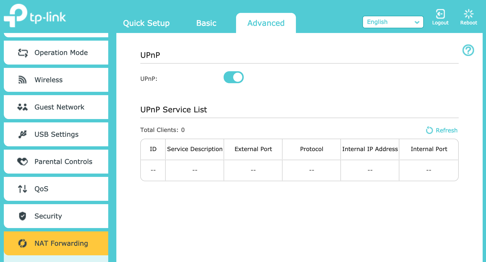

## Running node as docker image on Testnet

Ensure that You have the latest version:
```shell
# docker pull mysteriumnetwork/myst
```

Run node with VPN service on port 1194
```
# docker run \
    --cap-add NET_ADMIN \
    --net host \
    --name myst \
    --rm mysteriumnetwork/myst service \
    --openvpn.port 1194 \
    --agreed-terms-and-conditions
```

**Note1.**
By adding `--agreed-terms-and-conditions` command line option you accept our [Terms & Conditions](/about/terms-and-conditions/)

**Note2.**
It's mandatory to run container with `--net host` to correctly detect VPN service ip which needs to be published to clients, assuming that host has external interface with public ip

**Note3.**
It's mandatory to run container with `--net default --publish "1194:1194/udp"`, assuming that host machines is Windows/OSX. We support `--net host` only if host machine is Linux.

**Note4.**
It's mandatory to run container with `--net default --publish "1194:1194/udp"` and do port forwarding PUBLIC_IP:1194 -> NODE_IP:1194, assuming that host doesn't have external interface with public ip.
E.g. My publicly visible ip is [78.X.Y.Z] and my laptop's local ip [192.168.1.102], so I port forwarded 78.X.Y.Z:1194 -> 192.168.1.102:1194 in router, which I have access to.


## Running mysterium node on a Raspberry Pi

Mysterium node supports running a service on ARM architecture. As an example of such installation, it can be installed and running on the Raspberry Pi 3 Model B+.

### Preinstallation requirements
Installation of the Mysterium node was tested on the Raspbian operation system, but most of the other systems should be supported too.

Download and install a Raspbian image [https://www.raspberrypi.org/downloads/](https://www.raspberrypi.org/downloads/) to the SD card as described in the official Raspberry Pi documentation [https://www.raspberrypi.org/documentation/installation/installing-images/](https://www.raspberrypi.org/documentation/installation/installing-images/).

Once you have an installed operating system, make sure that you have an Internet connection, since the Mysterium Node requires it to run. Both wired and wireless connections are supported, but the wired connection should give a more stable and performant connection.

To run a Wireguard service you'll need to install Wireguard separately. Here is a description of how it can be installed: [https://github.com/adrianmihalko/raspberrypiwireguard](https://github.com/adrianmihalko/raspberrypiwireguard).

There are two possible ways to install the Mysterium node on Raspbian. Building it from source code or use a prebuilt binary DEB package.

#### Installing a Mysterium node from the source code

1) Make sure that you have Golang and Git installed.

2) Checkout to the Mysterium node repository:<br/>
    `git clone https://github.com/mysteriumnetwork/node.git`

3) Change directory to the node project:
   `cd node`

4) Download all required dependencies:
   `dep ensure`

5) Build the `myst` binary:
   `./bin/build`

6) Start a mysterium service:<br/>
   `bin/run --testnet service --agreed-terms-and-conditions`

And it should be ready to serve consumers.

#### Installing a Mysterium node using prebuilt DEB package

Prebuilt DEP packages available for downloading from the Mysterium node repository release page [https://github.com/mysteriumnetwork/node/releases](https://github.com/mysteriumnetwork/node/releases)

1) Download `myst_linux_armhf.deb` package to the Raspberry Pi.
2) Install the downloaded package:<br/>

```
sudo dpkg -i myst_linux_armhf.deb
sudo apt-get -f install
```

After the installation, the `mysterium-node` service be running automatically.

You can use a `sudo systemctl status mysterium-node` command to make sure a service is running correctly.

If you want to change configuration parameters of the running service you can change a `/lib/systemd/system/mysterium-node.service` a systemd unit file and restart a service:

```
sudo systemctl daemon-reload
sudo systemctl restart mysterium-node
```


## Node system requirements

Current node binaries should run on x86-64 linux architecture. Other architectures might work, but are not being tested.
We test our docker images on Ubuntu 16.04, Debian 9 and CentOS 7.

To be able to run docker image, Your OS should support docker. This usually means that Your OS should have linux kernel version >= 3.10

Since Mysterium Network node is written in `go` its memory footprint is quite small. Most of the resources will be consumed by OpenVPN, Ethereum wallet (integrated into our binary) and system itself.

Minimum resources we tested with was 1GB of RAM.

It is suggested to run a node on a decent network connection to give VPN users best experience.

## What OpenVPN version is required?

If You compiled a node or client on Your own, check that OpenVPN version on Your system is >= 2.4.4

## Router configuration for nodes behind NAT

NAT (Network Address Translation) is used to enable internet access for
computers that do not have an external internet address (IP). Usually of the form like
192.168.x.y or 10.x.y.z

If you are running a node on a computer behind NAT you will need some means to
enable access to your node from outside your local network. Below are suggested
methods to enable such external access.

Essentially you need to make ports on which node services run accessible from outside.
Such enablement is also called "_port forwarding_".

### Enable UPnP or NAT-PNP support

UPnP and NAT-PNP protocols provides automatic port configuration features for various routers (gateways).
Some routers have these features enabled by default, some have not. Below are some examples how to enable such features.

#### Mikrotik (RouterOS)

Enable UPnP: IP -> UPnP -> Enable


Enable UPnP interfaces: IP -> UPnP -> Interfaces


#### ZTE MF286

Enable UPnP: Advanced settings




#### TP-LINK AC1750

Enable UPnP: Advanced -> UPnP


### Port forwarding

If UPnP or NAT-PNP method doesn't help, you can try forwarding the port manually.
Port forwards are setup in your router.
You need to forward port `1194`.
A summary of the steps to setup a port forward in your router are:

1. Login to your router.
2. Navigate to your routers port forwarding section, also frequently called virtual server.
3. Create the port forward entries in your router.
4. Test that your ports are forwarded correctly.

https://www.pcworld.com/article/244314/how_to_forward_ports_on_your_router.html 
